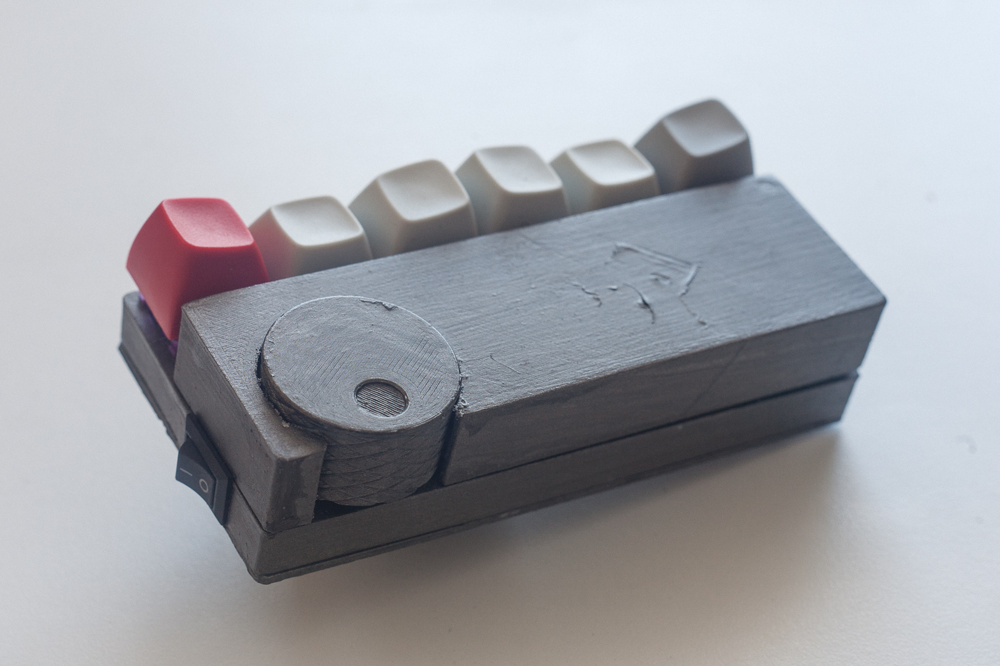
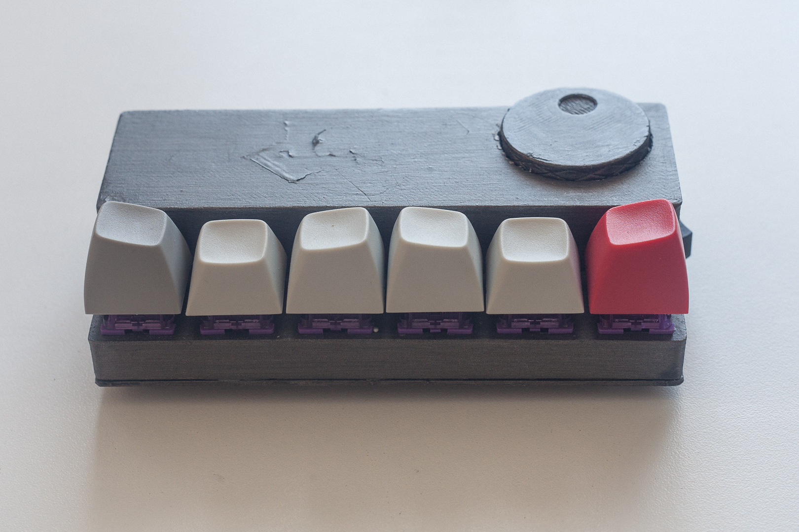

# media-macro-pad

## 📻 Project Description

A wireless macro pad for controlling media playback and volume control.

[More images...](images/gallery.md)

## 🧰 Features

- 6× programmable keys via [MK32 firmware](https://github.com/Galzai/MK32)
- Volume dial
- Connects via BLE
- 500mAh battery
- Charges via USB-C

## 📐 Changes

 - Relocated heatset inserts and bosses
 - Added lugs/lips to help align parts
 - Added support ribs/gussets
 - Changed top shell to use a magnet to stay in place
 - Fixed position of power switch
 - Correct spacing for MCU mounting
 - Removed LED
 - Offset knob to protude from rear of case
## ⚠️ Issues

> Current STL/FreeCAD models are not suitable for actual use!

- Top shell isn't secured firmly with only one magnet
- Lugs on top shell need to be made smaller to fit into slots in middle shell
- Tolerances around cutout for rotary encoder knob are too tight and need filing down

## 🛒 Bill of Materials (BOM)

> ⚠️ BoM is out of date and needs to be updated for latest revision.

| Item | Size | Qty | 
| ---- | ---- | --- |
| [DFrobot FireBeetle ESP32-E](https://www.dfrobot.com/product-2231.html) | N/A | 1 |
| KCD11 Rocker Switch | N/A | 1 | 
| Battery LiPo 500mAh 3.7V | 38.5×29.5×5mm | 1 |
| EC11 Rotary Encoder | 15mm shaft, 4.5mm base | 1 |
| MX switches | N/A | 6 |
| ~~LED, Red~~ |5mm | 1 |
| Resistor | 220 Ohm | 61 |
| Heat Set Inserts | M2.5×6mm | 3 |
| Screws | M2.5×6mm | 3 |
| 3D printed shell | N/A | 4 pcs |

1. I used external pull down resistors for this build to work around the peculiarlities that the ESP32 has with internal pull-up/downs when in sleep modes. 

## 🔗 References

- [MK32 firmware](https://github.com/Galzai/MK32)
- [Firebeetle ESP32-E (DFR0654) wiki](https://wiki.dfrobot.com/FireBeetle_Board_ESP32_E_SKU_DFR0654)
- [EspressIf API Reference](https://docs.espressif.com/projects/esp-idf/en/latest/esp32/api-reference/index.html)